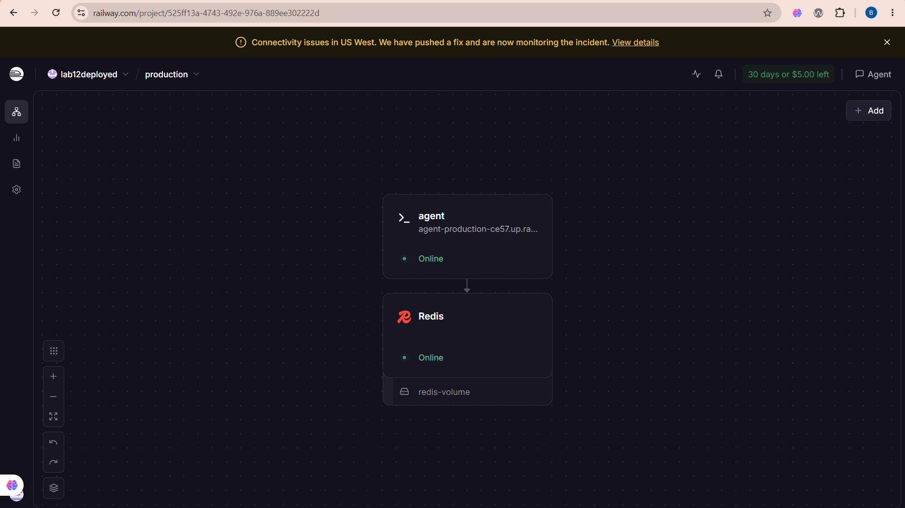
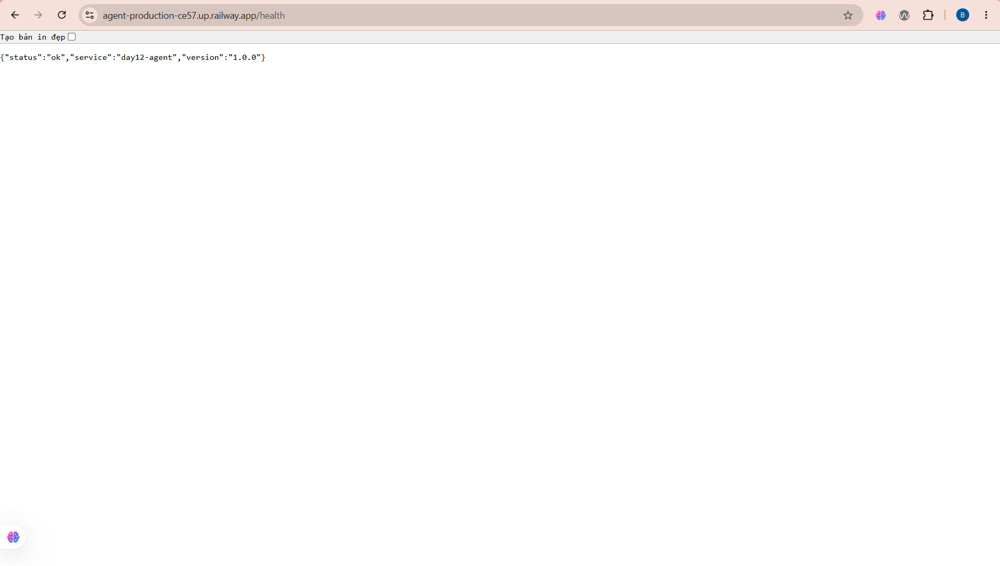

# Thông Tin Deploy — Checkpoint 5

> Điền file này sau khi deploy xong. `pytest tests/test_cp5.py` đọc file này
> để tìm địa chỉ service của bạn và gọi thử.
>
> **Chỉ ghi TÊN biến môi trường, tuyệt đối không dán giá trị API key vào đây.**
> Repo này công khai — dán khóa vào là mất khóa.

## Thông Tin Học Viên

| Mục | Nội dung |
|-----|----------|
| Họ và tên | Trần Việt Bách |
| Mã học viên | 2A202601773 |
| Repo | https://github.com/Tran-Viet-Bach/DAY12-2A202601773-TranVietBach |

## Service

| Mục | Nội dung |
|-----|----------|
| Public URL | https://agent-production-ce57.up.railway.app |
| Platform | Railway |
| Ngày deploy | 2026-08-10 |

Kiến trúc trên Railway: service `agent` (build từ `Dockerfile`, multi-stage,
chạy bằng user thường `appuser`) + database `Redis` gắn volume `redis-volume`.
Hai service nói chuyện qua mạng nội bộ `redis.railway.internal`, không phơi
Redis ra Internet.

## Biến Môi Trường Đã Set Trên Cloud

Ghi tên biến và **nguồn giá trị**, không ghi giá trị:

| Biến | Đã set | Ghi chú |
|------|--------|---------|
| `PORT` | ✅ | platform tự gán |
| `AGENT_API_KEY` | ✅ | đặt trong dashboard, không nằm trong repo |
| `REDIS_URL` | ✅ | Redis add-on của Railway, tham chiếu `Redis.REDIS_URL` |
| `RATE_LIMIT_PER_MINUTE` | ✅ | 10 |
| `MONTHLY_BUDGET_USD` | ✅ | 10.0 |
| `LOG_LEVEL` | ✅ | INFO |

## Lệnh Kiểm Tra

Thay `<URL>` bằng Public URL ở trên:

```bash
# 1. Liveness — mong đợi 200 {"status":"ok"}
curl -i <URL>/health

# 2. Readiness — mong đợi 200 {"status":"ready"} (đã nối được Redis)
curl -i <URL>/ready

# 3. Không có API key — mong đợi 401
curl -i -X POST <URL>/ask \
  -H "Content-Type: application/json" \
  -d '{"question":"Hello"}'

# 4. Có API key — mong đợi 200 kèm câu trả lời
curl -i -X POST <URL>/ask \
  -H "Content-Type: application/json" \
  -H "X-API-Key: $AGENT_API_KEY" \
  -H "X-User-Id: sv-test" \
  -d '{"question":"Deploy là gì?"}'

# 5. Rate limit — gọi 15 lần, những lần cuối phải trả 429
for i in $(seq 1 15); do
  curl -s -o /dev/null -w "%{http_code} " -X POST <URL>/ask \
    -H "Content-Type: application/json" \
    -H "X-API-Key: $AGENT_API_KEY" \
    -H "X-User-Id: sv-test" \
    -d '{"question":"test"}'
done; echo
```

## Kết Quả Chạy Thật

Chạy ngày 2026-08-10 với `<URL> = https://agent-production-ce57.up.railway.app`

```
### 1. GET /health
{"status":"ok","service":"day12-agent","version":"1.0.0"}
[HTTP 200]

### 2. GET /ready
{"status":"ready","redis":true}
[HTTP 200]

### 3. POST /ask  (không có API key)
{"detail":"invalid or missing API key"}
[HTTP 401]

### 4. POST /ask  (có API key)
{"answer":"Theo mình hiểu, Docker la gi liên quan tới cách hệ thống được đóng
gói và vận hành. Điểm mấu chốt là tách cấu hình ra khỏi code và giữ service ở
trạng thái stateless.","user_id":"sv-bach","history_length":0,
"cost_usd":2.505e-05,"tokens":{"in":3,"out":41}}
[HTTP 200]

### 5. Rate limit — 15 lần gọi liên tiếp
200 200 200 200 200 200 200 200 200 200 429 429 429 429 429
```

Đúng 10 lần đầu qua, 5 lần sau bị chặn — khớp với `RATE_LIMIT_PER_MINUTE=10`.

### Bằng chứng stateless (CP4)

Gọi `/ask` lần thứ hai với cùng `X-User-Id`, lịch sử được đọc lại từ Redis
chứ không nằm trong RAM của process:

```
{"answer":"Với Con Kubernetes, cách làm phổ biến trong production là đặt một
lớp gateway phía trước để lo authentication, rate limiting và bảo vệ chi phí.
(Mình đang nhớ 2 lượt trao đổi trước đó.)","user_id":"sv-bach",
"history_length":2,"cost_usd":3.48e-05,"tokens":{"in":48,"out":46}}
[HTTP 200]
```

`history_length` tăng 0 → 2, và `tokens.in` tăng 3 → 48 vì lịch sử được nạp
vào prompt. Đây cũng là lý do `ConversationStore.append` phải `ltrim` giới hạn
20 message: không giới hạn thì prompt và tiền token phình vô hạn.

## Ảnh Chụp Màn Hình

### Dashboard Railway — hai service cùng Online



Project `lab12deployed`, môi trường `production`: service `agent` và database
`Redis` (kèm volume `redis-volume`) đều ở trạng thái Online.

### Gọi `/health` trên URL công khai


